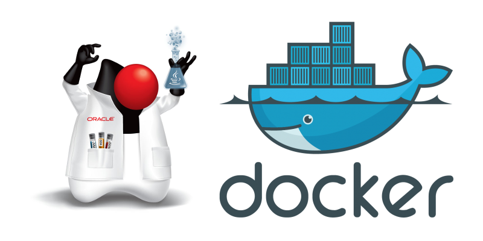

<!-- .slide: data-background="#FFFFFF" -->
<!-- .slide: data-color="#333333" -->

## Docker for Java Devs



2017-06-28 Code Garden Roma #AperiTech

---

# Francesco Uliana

## @warrior10111

- technologist @ CNR
- java/scala
- devops

---

# Agenda

- Docker commands
- Java development with Docker
- from monolith to microservices
- ~~production~~

---

# Docker


- Container virtualization
- Build, pack, ship and run applications as containers
- Build once, run in many places (Write once, run anywhere?)
- Isolated and content agnostic


<!-- .slide: data-background="#FFFFFF" -->
<!-- .slide: data-color="#333333" -->


<!-- .slide: data-background="#FFFFFF" -->
<!-- .slide: data-color="#333333" -->


---

# Getting started


## Hello World
```bash
docker run --rm \
  --name hello-world \
  hello-world
```

<https://hub.docker.com/_/hello-world/>


## (Java) Hello World

```bash
docker run --rm \
  --name hello-java \
  openjdk \
  javac -version
```


```bash
docker run --rm \
  --name hello-java \
  openjdk:7-jre-alpine \
  java -version
```


- __java__ image deprecated
- <https://hub.docker.com/r/library/openjdk/tags/>
  + alpine / debian
  + jre / jdk
  + 6 / 7 / 8 / 9
- legal issues with Oracle JDK


## Tomcat
```bash
docker run --rm \
  --name tomcat \
  --publish 8180:8080 \
  tomcat:8-alpine
```

<http://localhost:8180/>


## Volumes

```bash
docker run --rm --name hello-tomcat \
  --volume $(pwd)/hello.war:/usr/local/tomcat/webapps/hello.war \
  --publish 8180:8080 \
  tomcat:8-alpine
```

<http://localhost:8180/hello/>


```bash
docker exec hello-tomcat \
  ip address show
```


```bash
docker exec --tty --interactive hello-tomcat sh
```


## Building images

```bash
vim Dockerfile
```

```bash
docker build --tag francescou/hello .
```

```bash
docker run --rm francescou/hello
```

```bash
docker run --rm \
  --env '-Xmx64m' \
  --publish 8787:8787 \
  francescou/hello
```


## Links

```bash
docker run --name my-redis redis:3-alpine
```

```bash
docker run --rm --name webapp \
  --link my-redis:my-redis \
  --volume $(pwd)/spring-boot-redis.jar:/app.jar \
  openjdk:8-jre-alpine \
  java -jar /app.jar
```

---

# Java Development with Docker


## Maven

```bash
docker run --rm \
  --volume $(pwd)/spring-boot-redis/:/app/ \
  --workdir /app/ \
  maven:3.5-alpine \
  mvn clean package -DskipTests
```


## multi-stage builds

```Dockerfile
FROM maven:3.3.9-jdk-8-alpine as build-env
COPY ./spring-boot-redis/ /app/
WORKDIR /app
RUN mvn package -DskipTests

FROM gcr.io/distroless/java
WORKDIR /app
CMD ["app.jar"]
COPY --from=build-env /app/target/*.jar app.jar
```

```bash
docker build --tag francescou/spring-boot-redis \
  --file Dockerfile.multistep .
```

<https://github.com/jzaccone/office-space-dockercon2017/>


## JBoss/Wildfly

```bash
docker run --rm \
  --name wildfly \
  --publish 8787:8787 \
  --publish 8080:8080 \
  jboss/wildfly:10.1.0.Final \
  wildfly/bin/standalone.sh --debug -b 0.0.0.0
```


## Spring-boot devtools

```bash

docker run --rm \
  --name spring-boot \
  --publish 8180:8080 \
  --publish 8787:8787 \
  --publish 35729:35729 \
  --volume /home/francesco/.m2/repository/:/root/.m2/repository/ \
  --volume $(pwd)/spring-boot-devtools/:/app/ \
  --workdir /app/ \
  maven:3.5-alpine \
  mvn spring-boot:run -Drun.jvmArguments="-Xdebug -Xrunjdwp:transport=dt_socket,server=y,suspend=y,address=8787"
```


## Integration testing

```java
import org.testcontainers.containers.*;
// Set up a redis container

@ClassRule
public static GenericContainer redis =
    new GenericContainer("redis:3.0.2")
               .withExposedPorts(6379);
```
<https://github.com/testcontainers/testcontainers-java-examples/tree/master/spring-boot>

---

# Multi-container applications


## Docker Compose

```yml
  elasticsearch:
    image: docker.elastic.co/elasticsearch/elasticsearch
    environment: ['http.host=0.0.0.0']

  kibana:
    image: docker.elastic.co/kibana/kibana
    ports: ['127.0.0.1:5601:5601']
    depends_on: ['elasticsearch']

  logstash:
    image: docker.elastic.co/logstash/logstash
    volumes:
      - ./logstash.conf:/.../logstash/pipeline/logstash.conf
    depends_on: ['elasticsearch']
  ```


```bash
docker-compose --file docker-compose.yml \
  docker-compose-dev.yml up
```


## Swarm mode

- scaling, load balancing, service discovery
- self-healing and self-organizing

```bash
docker stack deploy --compose-file docker-compose.yml
```

```bash
HEALTHCHECK --interval=5m --timeout=3s \
  CMD curl --fail http://localhost/ || exit 1
```

---

# Case study

migration of a J2EE monolith to microservices


## Personal finances webapp

- incomes/expenses items, savings and account settings
- statistics - track cash flow dynamics in account lifetime
- notifications


## Monolith

- J2EE monolith
- RDBMS (MySQL/Oracle)
- JBoss 4
- JMS
- hard to maintain/monitor
- harder to evolve


<!-- .slide: data-background="#FFFFFF" -->
<!-- .slide: data-color="#333333" -->


## Microservices w/Spring Cloud
<!-- .slide: data-background="#FFFFFF" -->
<!-- .slide: data-color="#333333" -->


## sample projects

- <https://github.com/sqshq/PiggyMetrics>
- <http://www.kennybastani.com/2015/07/spring-cloud-docker-microservices.html>

---

# Integration


## Cloud
- AWS Container service
- Azure container service


## CI
- Jenkins plugin
- Gitlab CI
- TravisCI


## CD
- Netflix OSS spinnaker
- drone.io

---

# Conclusions


## Pros

- accelerate innovation
- portability across machines
- quick experimentation
- test/prod parity


## Cons

- security (avoid running as `root`)
- persistent containers (e.g. databases)
  - [Why Databases Are Not for Docker Containers](https://news.ycombinator.com/item?id=13582757)
  - [Is Docker Good for Your Database?](https://www.percona.com/blog/2016/11/16/is-docker-for-your-database/)
  - volume drivers?
- `-Xmx` vs `--memory` <https://youtu.be/yHLAaA4gPxw?t=26m50s>
  + `docker run --name memory-test --memory 16m francescou/memory-test`

---

# Resources

- <https://docs.docker.com/get-started/>
- <http://labs.play-with-docker.com/>
- <https://codefresh.io/blog/java_docker_pipeline/>
- <http://jberkus.github.io/perplexed/>
- <https://docs.docker.com/engine/docker-overview/>
- <https://youtu.be/yHLAaA4gPxw>
- <https://youtu.be/y9IYnEDSVEc>
- <https://blog.jessfraz.com/post/docker-containers-on-the-desktop/>

---

# Questions ?
